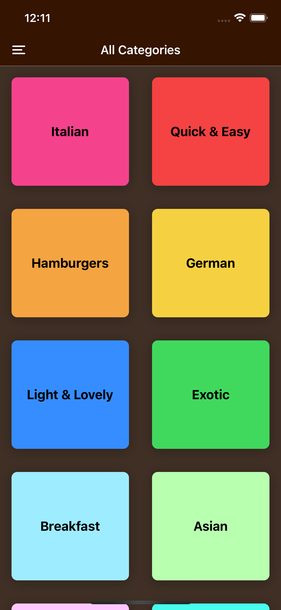
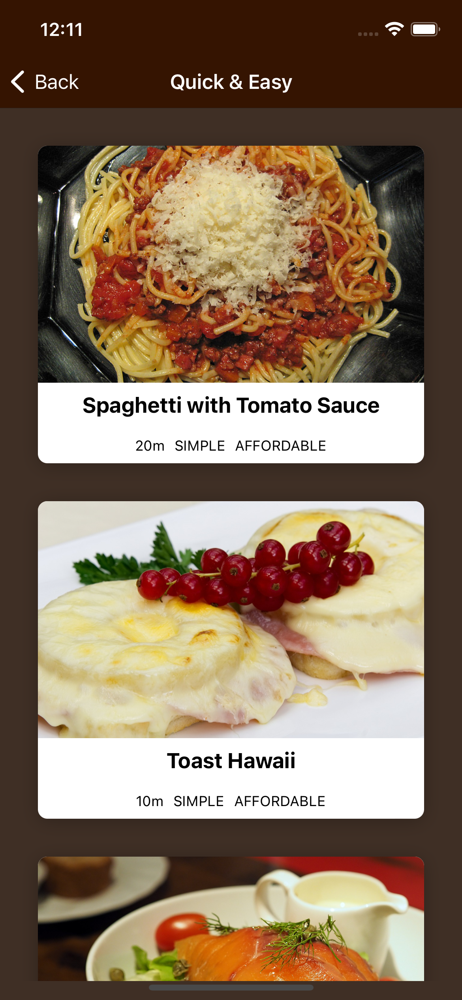
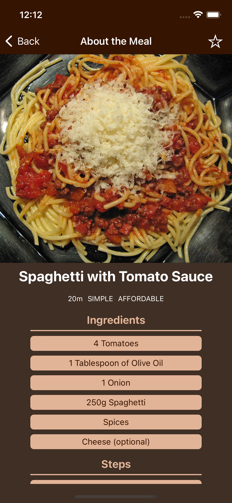
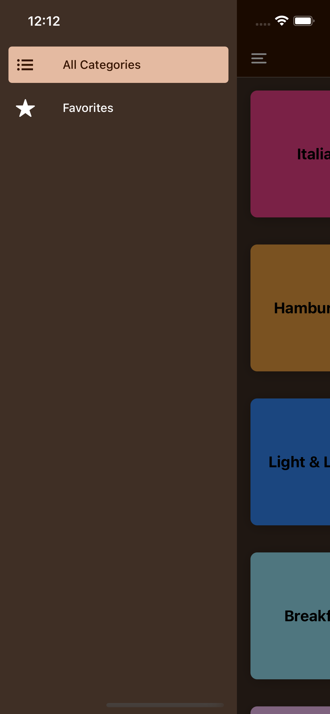
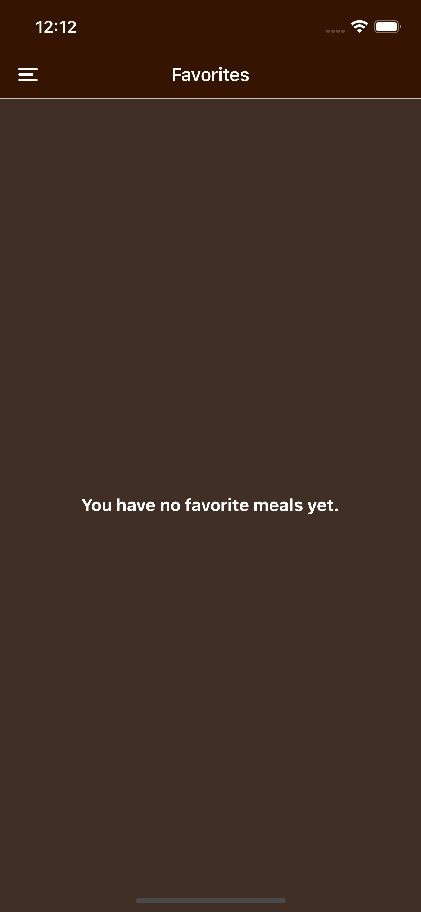
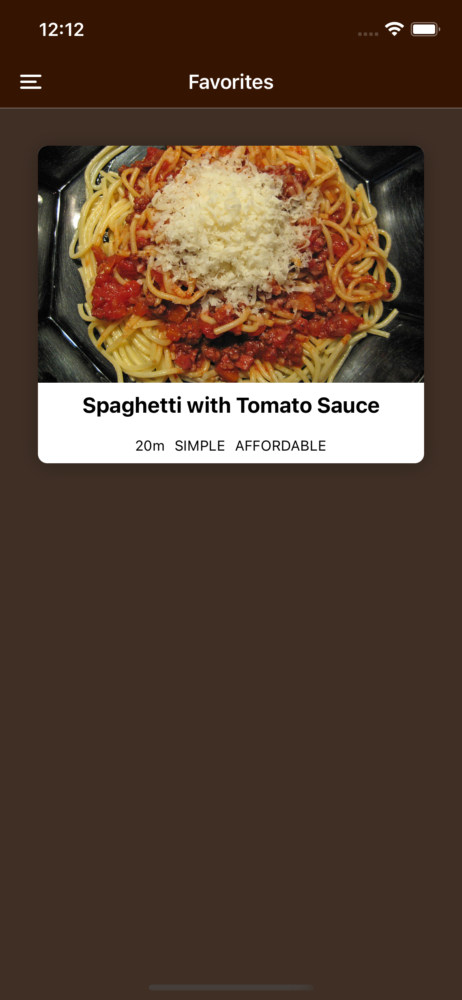

# Meals App 🎯
This app made by using React Native.
## Using Techs 🖥
- [React Native](https://reactnative.dev/)
- [React Navigation](https://reactnavigation.org/)
- [Expo](https://expo.dev/)
- [Context API](https://reactjs.org/docs/context.html)
## Screenshots from App 📸

